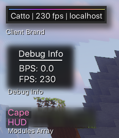
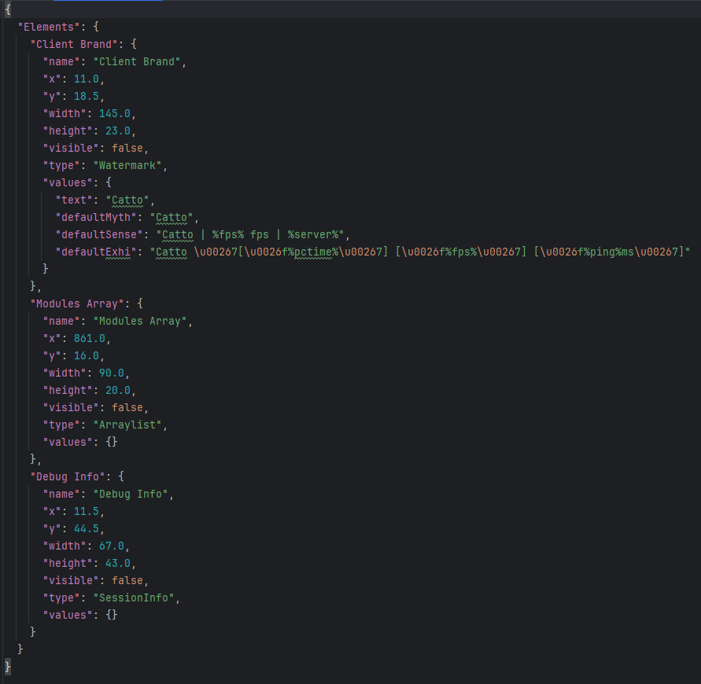

# Catto-Base
Most cutting edge 1.8.9 minecraft client of 2023 (real)

## About
This is a base for a 1.8.9 MavenMCP client. It's a project i used to work on in my free time, it's not finished and it's not even close to being finished. I'm not working on it anymore, but i'm leaving it here for anyone who wants to use it as a base for their own client. It's not the best code, but it's a good starting point for anyone who wants to make a client.


## Features
### Commands System
| Command | Alias | Description |
| --- | --- | --- |
| help | h | Shows all commands |
| bind | b | Binds a module to a key |
| toggle | t | Toggles a module |
| config | c | Manages module configs |
| hclip | hc | Horizontal clip |
| vclip | vc | Vertical clip |
| elements | e | Manages HUD elements |

### Modules System
Anotations are used to define modules, for example:
```java
@ModuleData(name = "ModuleName", description = "This Module Does what", category = Category)
```
Module categories are defined in the Category enum, for example:
```java
public enum Category {
    COMBAT, MOVEMENT, PLAYER, RENDER, MISC
}
```
Values system is used to define module settings, for example:
```java
public ModeSetting mode = new ModeSetting("Mode", this, new String[]{"TabList"}, "TabList");
public ModuleName() {
    addSettings(mode);
}
```
There are many other settings, such as BooleanSetting, ColorSetting, NumberSetting, NoteSetting, StringSetting, etc.

Modules are saved in the config file and can be modified.

### Config System
Config system is based on Gson, it's very simple and easy to use. It's not the best config system, but it works.

### HUD System
HUD system uses a custom element system, making it able to add custom elements to the HUD and move them around. they are saved in the config file and can be modified.
|| 

<details>
  <summary>Click to see images</summary>

  
  
</details>

### ClickGUI
ClickGUI is a simple GUI that allows you to toggle and configure modules, it's not the best GUI, but it works.

### ViaMCP
Able to join servers from 1.8 to 1.20. Select the version you want to join in multiplayer menu.

### And much more
There are many other features, but i'm too lazy to list them all. explore the code and see for yourself.

## Credits
| Author              | Description              | Github                                                           |
|---------------------|--------------------------|------------------------------------------------------------------|
| Marcelektro         | MavenMCP 1.8.9           | [MavenMCP 1.8.9](https://github.com/Marcelektro/MavenMCP-1.8.9)  |
| Hexeption           | Event System             | Lost? I count find it                                            |
| LiquidBounce Legacy | Utils and Rotations code | [LB Legacy](https://github.com/CCBlueX/LiquidBounce/tree/legacy) |
| ViaMCP              | ViaMCP                   | [ViaMCP](https://github.com/ViaVersionMCP/ViaMCP)                |

I'm sorry if i forgot to credit someone, i don't remember where i got all the code from. If you see something that belongs to you, please let me know and i will credit you.

## Requirements
 - 🤯🧠
 - Java 8
 - Maven
 - Git


## Installation
 - MavenMCP 1.8.9 [Read](https://github.com/Marcelektro/MavenMCP-1.8.9)
